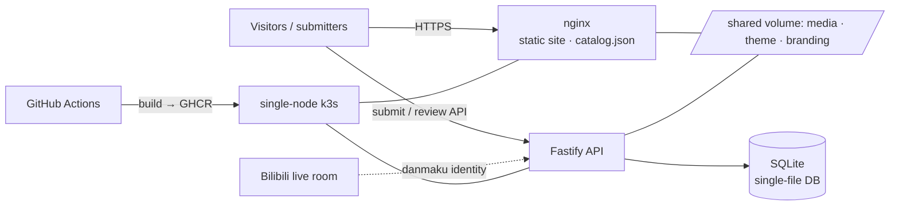

<div align="center">


# Joi Button · 轴伊按钮

**Build a museum of sound for the streamer you love.**

A batteries-included, full-stack voice-button website: fans submit clips right on the page,<br/>you audition and approve them in a visual review desk, and one command puts it all online.

[](https://github.com/ryanlan-new/joi-button/actions/workflows/image.yml)
[](LICENSE)
[](https://github.com/ryanlan-new/joi-button/commits/main)
[](https://github.com/ryanlan-new/joi-button/stargazers)

[](https://v2.vuejs.org/)
[](https://fastify.dev/)
[](https://www.sqlite.org/)
[](https://k3s.io/)

[简体中文](./README.md) | **English** | [日本語](./README.ja.md)

[🌐 Live demo](https://joi-button.tcrn-tms.com) · [🚀 Quick start](#-quick-start) · [✨ Feature tour](#-feature-tour) · [🎨 Make it your streamer's](#-make-it-your-streamers)

</div>

---

## 💡 What is this?

**Joi Button** is a complete voice-button website for a streamer: visitors click buttons to hear their favorite lines, fans submit new clips directly on the page, and the site owner auditions every one in an admin desk before publishing it with one click.

It was born for the VTuber [Joi_Channel](https://space.bilibili.com/61639371) and carries her name — **but it has been generic from the first line of code**. The site name, browser-tab title, nav icon, channel link, color theme, and wallpaper are all editable in the visual admin desk, no code required. Pick a streamer you love, and half an hour later you can be running their very own button site.

Unlike the classic "static button page + edit a JSON + send a PR" approach, this is a full content pipeline:

> **A fan uploads on the page → verifies identity with a single danmaku → you audition and decide at the desk → publish** — nobody ever has to touch Git.

## 🌐 Live demo

The original Joi Button runs on exactly this code: **<https://joi-button.tcrn-tms.com>** — every button, wallpaper, and caption you see there grew out of the features below.

## ✨ Feature tour

### 🎧 For visitors

- **A wall of buttons**: voice clips arranged by group, click to play, with continuous playback; each button keeps its ⓘ info control fixed on the right with a reserved lane and equal inner spacing, so hover never changes the button layout, and the control hides again when the pointer leaves after viewing details;
- **Trilingual site**: Simplified Chinese / English / Japanese — from button captions to the submission page to the admin desk, switchable in one click;
- **Themes and wallpaper**: colors and wallpaper tuned in the admin desk go live on the next page load — no rebuild, no redeploy.

### 📮 Frictionless submission (kindness to fans)

- **Upload right on the page**: MP3 / M4A / OGG / WAV, up to 5 MB per clip, up to 10 clips per batch (tunable);
- **Explicit submission fields**: source information is always visible; required fields carry an asterisk, while optional fields are left unstarred;
- **Identity in a single danmaku**: no accounts, no passwords — the site hands the submitter a one-time phrase, they post it as a danmaku in the streamer's Bilibili live room, and identity is verified. A passing fan really can submit on a whim;
- **Automatic loudness normalization**: clips are normalized at intake, so nobody has to run MP3Gain and every button on the site plays at the same level;
- **Duplicate interception**: a submission byte-identical to a published clip is politely refused on the spot, naming the button that already plays it;
- **Optional human check**: Cloudflare Turnstile behind a switch; running with it off is fully supported.

### 🛡️ The review desk (kindness to the owner)

A nine-tab visual admin console that works on your phone:

| Tab | What you do there |
| --- | --- |
| **Queue** | Review in arrival order; whole-row click, submitter history and batch progress at a glance |
| **Publish** | Two-stage releases: approving ≠ going live — batch up drafts, then push them out at once |
| **Library** | Every clip on the site; retire / restore any of them, the public catalogue rewrites instantly |
| **Recycle bin** | Rejection is not the end: overturn it into an approval within a 30-day window |
| **Log** | Append-only audit trail, filterable by action / subject / person / role |
| **Storage** | Reclaim the audio of expired rejections — preview first, delete second, every step audited |
| **Theme** | Visual color editor + wallpaper upload, live on save |
| **Branding** | Site name, tab title, favicon, channel link — make it your streamer's site |
| **Admins** | Invite-based co-administration: a new admin binds identity with, again, a single danmaku |

A few details worth bragging about:

- **The listen-through gate**: the Approve button stays disabled until the clip has been played to its end — and it genuinely catches truncated files;
- **Rejections require a reason**, shown verbatim to the submitter: a refusal nobody can appeal is not a refusal;
- **The audit log is append-only**: every approval, rejection, revision, publish, and reclaim is on the record, and the record cannot be rewritten.

### 🚀 Operations (kindness to future-you)

- **One-command deploy**: `deploy/bootstrap.sh` walks six interactive steps — collect settings → confirm DNS → TLS (auto Let's Encrypt or bring your own) → bring up the services → bind the first admin → full self-check. Every step is re-runnable; a second run confirms and repairs instead of duplicating;
- **A tag is a release**: push a `v*.*.*` tag and GitHub Actions builds the image (public GHCR, no login to pull) and deploys it to your server; pushing `main` only builds — going live stays your call;
- **Daily automatic backups**: consistent database snapshots + a content-addressed media pool, `--verify` to check them, `--restore` to bring everything back, plus a script for pulling an off-site copy;
- **A zero-dependency data layer**: one SQLite file plus one media directory *is* the entire state — no database server to babysit, and backup/migration are almost embarrassingly simple;
- **One small cloud box is enough**: a single-node k3s carries the whole thing.

## 🚀 Quick start

### 🎫 Prerequisite: the Bilibili Live Open Platform (one-time, ~10 minutes + review)

"Identity in a single danmaku" rides the official **Bilibili Live Open Platform** danmaku feed, which needs a set of official credentials. Have these five values ready before deploying — step 1 of the guided script asks for each:

| Environment variable | What it is | Where to get it |
| --- | --- | --- |
| `BILI_APP_ID` | Project id (not secret) | The project page in the Open Platform console, after you create a project |
| `BILI_ROOM_ID` | Live-room number (not secret) | The number in the room's URL, `live.bilibili.com/<number>` |
| `BILI_ACCESS_KEY_ID`<br/>`BILI_ACCESS_KEY_SECRET` | Developer key pair (🔒 secret) | Sent by official email after the application is approved |
| `BILI_ROOM_OWNER_AUTH_CODE` | Streamer identity code, 身份码 (🔒 secret) | [play-live.bilibili.com](https://play-live.bilibili.com/) (the streamer-side "幻星" portal) |

How to apply:

1. Sign in at [open-live.bilibili.com](https://open-live.bilibili.com/) with a Bilibili account, enter the **creator service center**, complete the identity verification it asks for and submit an **individual developer** application (no company required);
2. Once officially approved, the `access_key_id` / `access_key_secret` pair is sent by email;
3. **Create a project** in the console; the **project ID** shown on its page is your `BILI_APP_ID`;
4. Have **the streamer themselves** visit [play-live.bilibili.com](https://play-live.bilibili.com/) and fetch their **identity code** — it is what authorises this project for their room;
5. Read the room number off the live room's URL.

> ⚠️ **Refreshing the identity code invalidates the old one immediately.** If it is ever refreshed on that page, re-run `deploy/bootstrap.sh env` with the new code and redeploy — otherwise danmaku verification stops working silently, with no other symptom.
>
> The site only **listens** for the verification phrases submitters post; it never sends a danmaku on anyone's behalf. The key pair is used solely to sign requests to the danmaku gateway.

### Deploy to production (about half an hour)

You need: one Linux server (single-node k3s is fine) + a domain pointing at it (a LAN hostname works too) + the Bilibili credentials from the section above.

```bash
git clone https://github.com/ryanlan-new/joi-button.git
cd joi-button
deploy/bootstrap.sh
```

Answer a few questions and the guided script will, in order:

1. **Collect settings** — live-room id, identity code, limits; secrets are generated for you and never echoed;
2. **Domain** — tells you which DNS record to add and confirms it resolves;
3. **TLS** — automatic Let's Encrypt, or your own certificate files;
4. **Deploy** — builds/pulls images and brings up every service;
5. **First admin** — you log in once; the script captures your identity and allow-lists it;
6. **Self-check** — pods Ready, cert issued, HTTPS 200, login working, all ticked off.

Upgrading later:

```bash
git tag v1.0.0 && git push origin v1.0.0   # auto-build + auto-deploy
```

### Local development

```bash
npm install && npm run serve      # frontend with hot reload
cd server && npm install
LOCAL_SESSION_SECRET="$(node -e "console.log(require('crypto').randomBytes(32).toString('base64url'))")"
NODE_ENV=development DANMAKU_MODE=development TURNSTILE_MODE=development \
TURNSTILE_SWITCH=off DEV_PLAIN_HTTP=1 HOST=127.0.0.1 PORT=8081 \
SESSION_SECRET="$LOCAL_SESSION_SECRET" npm run dev   # API; local admin is login-free
```

With `NODE_ENV=development`, the API injects an admin session for local acceptance. Open `/admin` directly; this bypass is never enabled in production.

Tests and quality gates: `cd server && npm test` (450+ server cases) · `npm test` (frontend) · `npm run contrast` (an automated contrast gate for the admin palette).

## 🎨 Make it your streamer's

This project is **not** Joi-only. Turning it into *your* streamer's button site takes three steps, all in the browser:

1. **Branding** tab: change the site name, tab title, and channel link, and upload their favicon — the nav icon follows;
2. **Theme** tab: dial in their fan colors and upload their wallpaper;
3. Start accepting submissions — clips, captions, and groups grow out of the content pipeline; no data needs to be pre-seeded.

Want to replace the default copy and sample clips too? The three locale files live in [src/locales](src/locales), and the sample catalogue in [src/voices.json](src/voices.json) and [public/voices](public/voices) (used only to seed a fresh install). That part is purely optional polish — without it, the three steps above already give you a complete site of *theirs*.

## 🏗️ Tech and architecture

Vue 2.7 frontend (built to a fully static site), Fastify 5 + better-sqlite3 API, nginx in front, single-node k3s orchestration, GitHub Actions + GHCR for continuous delivery.

<details>
<summary>Show the architecture diagram</summary>



</details>

Details you can trust: a STRICT-mode schema with exhaustive CHECK constraints; content-addressed storage with atomic writes; an append-only audit log; 450+ server test cases and replayable migrations; the admin palette is held to WCAG thresholds by an automated contrast gate.

## 🤝 Submitting and contributing

- **Voice clips go through the site** (the entry is right in the header), not through Pull Requests. This is deliberate: clips and their descriptions are someone else's creations — written into Git history they can never truly be taken back, while a database can forget a submission on request;
- **Translations** are maintained by the owner and not currently open to contribution;
- **Code** PRs are welcome — for anything larger than a fix, an issue first saves us both a round trip.

More docs: [deployment & operations details](deploy/k8s/README.md).

## 📄 License and thanks

Code is open-sourced under the [MIT](LICENSE) license.

This is a fan work, unaffiliated with VirtuaReal / Nijisanji. Built upon monoAI's [Luna button](https://github.com/monoai) — with gratitude.

<div align="center">

**If this project helped you build a museum of sound for someone you love, a ⭐ would make our day**

</div>
