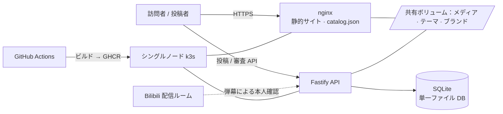

<div align="center">


# Joiボタン · 轴伊按钮

**推しの配信者のために、声の博物館を建てよう。**

投稿から審査、公開までを一気通貫でこなす音声ボタンサイトのフルスタック一式。<br/>ファンはページ上でそのまま投稿、あなたはビジュアル審査デスクで聴いて判断、デプロイはコマンド一つ。

[](https://github.com/ryanlan-new/joi-button/actions/workflows/image.yml)
[](LICENSE)
[](https://github.com/ryanlan-new/joi-button/commits/main)
[](https://github.com/ryanlan-new/joi-button/stargazers)

[](https://v2.vuejs.org/)
[](https://fastify.dev/)
[](https://www.sqlite.org/)
[](https://k3s.io/)

[简体中文](./README.md) | [English](./README.en.md) | **日本語**

[🌐 デモを見る](https://joi-button.tcrn-tms.com) · [🚀 クイックスタート](#-クイックスタート) · [✨ 機能ツアー](#-機能ツアー) · [🎨 推しのサイトにする](#-推しのサイトにする)

</div>

---

## 💡 これは何？

**Joiボタン**は、配信者のための本格的な音声ボタンサイトです。訪問者はボタンを押して名台詞を聴き、ファンはページ上で新しい音声をそのまま投稿し、サイト管理人は審査デスクで一つひとつ聴いてから、ワンクリックで公開します。

VTuber の [Joi_Channel（轴伊）](https://space.bilibili.com/61639371)のために生まれ、彼女の名を冠していますが——**最初の一行から汎用に作られています**。サイト名・タブタイトル・ナビアイコン・チャンネルリンク・配色・壁紙は、すべてビジュアル管理画面から変更でき、コードには一切触れません。好きな配信者を思い浮かべてください。30 分後には、その人だけのボタンサイトが動いています。

昔ながらの「静的ページ + JSON を編集して PR」方式とは違い、これは完全なコンテンツパイプラインです：

> **ファンがページで投稿 → 弾幕一つで本人確認 → デスクで聴いて判断 → 公開** —— 誰も Git に触れる必要はありません。

## 🌐 デモを見る

本家 Joiボタンがまさにこのコードで動いています：**<https://joi-button.tcrn-tms.com>** —— そこにあるボタンも壁紙も字幕も、すべて下記の機能から育ったものです。

## 📦 最新リリース：v2.7.0（2026-08-10）

このリリースでは INIT-002 のフロントエンド / 管理画面改修を完成させ、受け入れ時に見つかった操作上の問題を解消しました：

- **ローカル管理画面をログイン不要に**：開発モードではローカル管理者セッションを注入するため、`/admin` を直接開いて確認できます。本番ではこの経路を有効にしません；
- **音声情報の操作を安定化**：ⓘ はボタン内右側に固定し、専用の幅と左右の等しい内側余白を確保。ホバーでボタンが跳ねず、クリック後にポインターを外せば正しく消えます；
- **投稿項目を明確化**：ソース情報を常に表示し、必須項目にはアスタリスクを付け、任意項目には「入力不要」を示す曖昧なラベルを使いません；
- **品質ゲートを完了**：フロントエンド UI コントラクトテスト、サーバーテスト、管理画面のコントラスト検査、本番ビルドを検証済みです；
- **リポジトリを整理**：歴史的な `docs/` ディレクトリをバージョン管理から削除し、`.gitignore` でローカルの同名ディレクトリは引き続き無視します。

詳しい内容：[v2.7.0 リリース](https://github.com/ryanlan-new/joi-button/releases/tag/v2.7.0)。

## ✨ 機能ツアー

### 🎧 訪問者側

- **ボタンの壁**：グループごとに並んだ音声ボタン。クリックで再生、連続再生にも対応；
- **三言語サイト**：簡体字中国語 / 英語 / 日本語。ボタンの字幕から投稿ページ、管理画面までワンクリックで切替；
- **テーマと壁紙**：管理画面で調整した配色と壁紙は、次のページ読み込みで即反映——再ビルド不要、再デプロイ不要。

### 📮 気軽に投稿できる（ファンへの誠意）

- **ページから直接アップロード**：MP3 / M4A / OGG / WAV、1 件最大 5 MB、1 回最大 10 件（調整可）；
- **弾幕一つで本人確認**：アカウント登録もパスワードも不要——サイトが発行するワンタイムフレーズを配信者の Bilibili 配信ルームに弾幕として送るだけで確認完了。「通りすがりのファンがふらっと投稿できる」を本当に実現；
- **ラウドネス自動正規化**：受付時に音量を自動で揃えるので、投稿者が MP3Gain を回す必要はなく、サイト上のボタンは常に同じ音量；
- **重複の自動検出**：公開済み音声とバイト単位で同一の投稿はその場で丁重にお断りし、どのボタンで既に鳴っているかをお知らせ；
- **人間確認はお好みで**：Cloudflare Turnstile をスイッチ一つで。オフのままでも安全に運用できます。

### 🛡️ 審査デスク（管理人への誠意）

9 つのタブからなるビジュアル管理画面。スマホからでも審査できます：

| タブ | できること |
| --- | --- |
| **一覧** | 到着順に審査。行全体がクリック可能、投稿者の履歴と束の進捗も一目で |
| **公開** | 二段階リリース：承認 ≠ 公開。下書きを溜めて、まとめて一括公開 |
| **音声庫** | 全音声を一覧し、いつでも取り下げ / 復帰。公開カタログは即座に書き直し |
| **ごみ箱** | 却下は終点ではない：30 日の保持期間内なら「承認に変更」で救済可能 |
| **記録** | 追記専用の監査ログ。操作 / 対象 / 人 / 役割で自在に絞り込み |
| **ストレージ** | 期限切れ却下音声の回収。まずプレビュー、それから削除、全工程を記録 |
| **テーマ** | ビジュアル配色エディタ + 壁紙アップロード、保存で即反映 |
| **ブランド** | サイト名・タブタイトル・favicon・チャンネルリンク——推しのサイトに早変わり |
| **管理者** | 招待制の共同運営：新しい管理者もまた、弾幕一つで本人確認 |

自慢したい小さなこだわり：

- **聴き切りゲート**：音声を最後まで聴くまで「承認」ボタンは点灯しません。飾りではなく、切り詰められたファイルを実際に検出します；
- **却下には理由が必須**で、その理由は投稿者にそのまま表示されます。「申し立てできない拒否は拒否ではない」から；
- **監査ログは追記専用**：承認・却下・再判定・公開・回収のすべてが記録に残り、記録は書き換えられません。

### 🚀 運用（未来の自分への誠意）

- **コマンド一つでデプロイ**：`deploy/bootstrap.sh` が対話形式で六つのステップを案内——設定収集 → DNS 確認 → TLS 証明書（Let's Encrypt 自動発行 or 持ち込み）→ サービス起動 → 初代管理者の紐付け → 全経路セルフチェック。どのステップも再実行可能で、二度目は重複ではなく確認と修復になります；
- **タグを打てばリリース**：`v*.*.*` タグを push すると GitHub Actions がイメージをビルド（GHCR 公開リポジトリ、ログイン不要で取得）し、サーバーへ自動デプロイ。main への push はビルドのみ——公開のタイミングはあなたの手に；
- **毎日の自動バックアップ**：整合性の取れた DB スナップショット + コンテンツアドレス方式のメディアプール。`--verify` でいつでも検証、`--restore` 一発で復元、オフサイトコピー取得スクリプトも同梱；
- **外部依存ゼロのデータ層**：SQLite ファイル一つ + メディアディレクトリ一つが状態のすべて——世話の要る DB サーバーはなく、バックアップも移行も拍子抜けするほど簡単；
- **小さなクラウドサーバー一台で十分**：シングルノード k3s が全コンポーネントを載せます。

## 🚀 クイックスタート

### 🎫 事前準備：Bilibili 直播開放平台の申請（一度きり、約 10 分 + 審査）

「弾幕一つで本人確認」は公式の **哔哩哔哩直播開放平台（Bilibili Live Open Platform）** の弾幕フィードを使うため、公式のクレデンシャル一式が必要です。デプロイ前に次の五つの値を揃えてください——ガイドスクリプトのステップ 1 で順に聞かれます：

| 環境変数 | 何か | 入手場所 |
| --- | --- | --- |
| `BILI_APP_ID` | プロジェクト ID（非機密） | 開放平台コンソールでプロジェクト作成後、そのプロジェクトページ |
| `BILI_ROOM_ID` | 配信ルーム番号（非機密） | ルーム URL `live.bilibili.com/<番号>` の数字 |
| `BILI_ACCESS_KEY_ID`<br/>`BILI_ACCESS_KEY_SECRET` | 開発者キーペア（🔒 機密） | コンソールの**プロフィールページ**——プロジェクトページではない点に注意 |
| `BILI_ROOM_OWNER_AUTH_CODE` | 配信者の身分コード・身份码（🔒 機密） | [play-live.bilibili.com](https://play-live.bilibili.com/)（配信者向け「幻星」ポータル） |

申請の手順：

1. Bilibili アカウントで [open-live.bilibili.com](https://open-live.bilibili.com/) にログインし、**クリエイターサービスセンター**へ。案内に従って本人確認を済ませ、**個人開発者**として入居申請を提出（企業資格は不要、審査は約 2 営業日）；
2. 承認後、コンソールの**プロフィールページ**で `access_key_id` / `access_key_secret` を取得；
3. コンソールで**プロジェクトを作成**。プロジェクトページに表示される**プロジェクト ID** が `BILI_APP_ID`；
4. **配信者本人**のアカウントで [play-live.bilibili.com](https://play-live.bilibili.com/) にアクセスし、**身分コード**を取得——このコードがプロジェクトをその配信ルームに紐付けます；
5. ルーム番号は配信ルームの URL から読み取るだけ。

> ⚠️ **身分コードを更新すると旧コードは即座に無効になります。** あのページで更新した場合は、新しいコードで `deploy/bootstrap.sh env` を再実行して再デプロイしてください——さもないと弾幕認証は他に何の症状もなく静かに動かなくなります。
>
> 本サイトは投稿者が送る確認フレーズを**聴くだけ**で、誰かの代わりに弾幕を送ることはありません。キーペアは弾幕ゲートウェイへのリクエスト署名にのみ使われます。

### 本番デプロイ（約 30 分）

必要なもの：Linux サーバー一台（k3s シングルノードで可）+ そこへ向けたドメイン（LAN 内ホスト名でも可）+ 前節で揃えた Bilibili クレデンシャル。

```bash
git clone https://github.com/ryanlan-new/joi-button.git
cd joi-button
deploy/bootstrap.sh
```

あとはいくつかの質問に答えるだけ。ガイドスクリプトが順に：

1. **設定収集**——配信ルーム番号・身分コード・各種上限。シークレットは自動生成され、画面に表示されません；
2. **ドメイン**——追加すべき DNS レコードを提示し、反映を確認；
3. **TLS**——Let's Encrypt の自動発行、または持ち込み証明書；
4. **デプロイ**——イメージをビルド / 取得し、全サービスを起動；
5. **初代管理者**——あなたが一度ログインすると、スクリプトが身元を捕捉して許可リストへ；
6. **セルフチェック**——Pod Ready・証明書発行・HTTPS 200・ログイン可、を順に確認。

その後のアップグレード：

```bash
git tag v1.0.0 && git push origin v1.0.0   # 自動ビルド + 自動デプロイ
```

### ローカル開発

```bash
npm install && npm run serve      # フロントエンド（ホットリロード）
cd server && npm install
LOCAL_SESSION_SECRET="$(node -e "console.log(require('crypto').randomBytes(32).toString('base64url'))")"
NODE_ENV=development DANMAKU_MODE=development TURNSTILE_MODE=development \
TURNSTILE_SWITCH=off DEV_PLAIN_HTTP=1 HOST=127.0.0.1 PORT=8081 \
SESSION_SECRET="$LOCAL_SESSION_SECRET" npm run dev   # API；ローカル管理画面はログイン不要
```

`NODE_ENV=development` では、API がローカル確認用の管理者セッションを注入します。`/admin` を直接開いてください。このバイパスは本番では有効になりません。

テストと品質ゲート：`cd server && npm test`（サーバー側 450+ ケース）· `npm test`（フロントエンド）· `npm run contrast`（管理画面配色のコントラストゲート）。

## 🎨 推しのサイトにする

このプロジェクトは**轴伊専用ではありません**。「推しのボタンサイト」にするのに必要なのは三歩、すべてブラウザの中で完結します：

1. **ブランド**タブ：サイト名・タブタイトル・チャンネルリンクを変更し、推しの favicon をアップロード——ナビアイコンも追随します；
2. **テーマ**タブ：推しのイメージカラーに調色し、壁紙を一枚；
3. 投稿を受け付け始める——音声も字幕もグループも、コンテンツパイプラインから育っていきます。データの事前投入は不要。

デフォルト文言やサンプル素材まで差し替えたい場合は、[src/locales](src/locales) の三つの多言語ファイルと、初回インストール時のシード用カタログ [src/voices.json](src/voices.json)・[public/voices](public/voices) をどうぞ。ここは完全に任意の仕上げで——触らなくても、上の三歩だけで既に「その人のサイト」です。

## 🏗️ 技術とアーキテクチャ

フロントエンドは Vue 2.7（完全静的サイトとしてビルド）、API は Fastify 5 + better-sqlite3、前段に nginx、オーケストレーションはシングルノード k3s、継続的デリバリーは GitHub Actions + GHCR。

<details>
<summary>アーキテクチャ図を開く</summary>



</details>

信頼できるディテール：STRICT モードのスキーマと網羅的な CHECK 制約；コンテンツアドレス方式のストレージとアトミック書き込み；追記専用の監査ログ；450+ のサーバーテストと再実行可能なマイグレーション；管理画面の配色は自動コントラストゲート（WCAG 基準）が見張っています。

## 🤝 投稿とコントリビュート

- **音声の投稿はサイトから**（ヘッダーに入口があります）。Pull Request では受け付けません。これは意図的な設計です：音声とその説明文は他者の創作物であり、Git の履歴に書き込めば本当の意味で取り消すことは二度とできません。データベースなら、求めに応じて一件を忘れられます；
- **翻訳**は管理人がメンテナンスしており、現在外部からの貢献は受け付けていません；
- **コード**の PR は歓迎です——修正より大きな変更は、先に issue を立てていただけるとお互い無駄足になりません。

その他のドキュメント：[デプロイ・運用の詳細](deploy/k8s/README.md)。

## 📄 ライセンスと謝辞

コードは [MIT](LICENSE) ライセンスで公開しています。

本プロジェクトはファン作品であり、VirtuaReal / にじさんじ公式とは関係ありません。monoAI の [Luna button](https://github.com/monoai) を土台に作られました——感謝を込めて。

<div align="center">

**このプロジェクトが、あなたの推しのための「声の博物館」づくりに役立ったなら、⭐ をひとつ頂けると嬉しいです**

</div>
