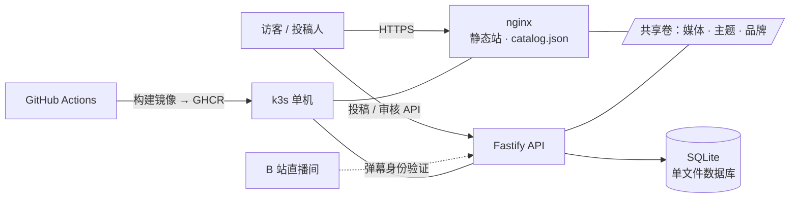

<div align="center">


# 轴伊按钮 · Joi Button

**为你喜欢的主播，搭建一座会出声的博物馆。**

一套开箱即用的「音声按钮网站」全栈方案 —— 粉丝在网页上直接投稿，<br/>你在可视化审核台里听完、定夺、发布，一条命令部署上线。

[](https://github.com/ryanlan-new/joi-button/actions/workflows/image.yml)
[](LICENSE)
[](https://github.com/ryanlan-new/joi-button/commits/main)
[](https://github.com/ryanlan-new/joi-button/stargazers)

[](https://v2.vuejs.org/)
[](https://fastify.dev/)
[](https://www.sqlite.org/)
[](https://k3s.io/)

**简体中文** | [English](./README.en.md) | [日本語](./README.ja.md)

[🌐 在线体验](https://joi-button.tcrn-tms.com) · [🚀 快速开始](#-快速开始) · [✨ 功能全览](#-功能全览) · [🎨 为你的主播定制](#-为你的主播定制)

</div>

---

## 💡 这是什么？

**轴伊按钮**是一个完整的主播音声按钮网站：访客点击按钮就能听到主播的经典语音，粉丝可以在网页上直接投稿新音声，站长在后台听完每一条、写下定夺、一键发布上线。

它因 VTuber [轴伊 Joi_Channel](https://space.bilibili.com/61639371) 而生，名字也来自她——**但它从第一行代码起就是通用的**。站名、标签页标题、导航图标、频道链接、主题配色、壁纸，全部都能在可视化后台里改，不用碰代码。挑一位你喜欢的主播，半小时后你就能拥有一座属于 ta 的音声按钮站。

和传统「静态按钮页 + 改 JSON 发 PR」的方案不同，这里是一条完整的内容流水线：

> **投稿人在网页上传 → 用一条弹幕完成身份验证 → 你在审核台听完定夺 → 发布上线** —— 全程无需任何人碰 Git。

## 🌐 在线体验

轴伊按钮本尊就跑在这套代码上：**<https://joi-button.tcrn-tms.com>** —— 你现在看到的每个按钮、每张壁纸、每条字幕，都是从下面这些功能里长出来的。

## ✨ 功能全览

### 🎧 访客这一侧

- **按钮墙**：按分组陈列的音声按钮，点击即播，支持连播；每个按钮内的ⓘ信息入口固定在右侧，带有稳定的预留宽度与等距内边距，悬浮查看时不会改变按钮布局，移开鼠标后信息入口会收起；
- **三语站点**：简体中文 / English / 日本語，从按钮字幕到投稿页到后台全覆盖，一键切换；
- **主题与壁纸**：站长在后台调好的配色与壁纸，访客下一次刷新即见——无需重新构建、无需重新部署。

### 📮 零门槛投稿（对粉丝的诚意）

- **网页直传**：MP3 / M4A / OGG / WAV，单条最大 5 MB，一次最多 10 条（可调）；
- **字段清晰**：来源信息始终显示；必填字段用星号标出，选填字段不加星号；
- **一条弹幕完成身份验证**：不注册、不设密码——站点发给投稿人一句一次性口令，到主播的 B 站直播间发一条弹幕，身份即验证完成。真正做到「路过的粉丝顺手就能投」；
- **响度自动归一化**：收件时自动统一响度，投稿人不必自己跑 MP3Gain，站上的每个按钮音量整齐划一；
- **重复自动拦截**：与已上线音声字节相同的投稿会被当场婉拒，并告知它已经在哪个按钮上；
- **统一节流与存储闸门**：网页和第三方 API 共用每分钟投稿限制；磁盘低于固定保留线时，投稿和后台上传都会明确拒绝。
- **第三方 API**：令牌、机读投稿契约和零依赖调用示例见 [docs/api.md](docs/api.md)。

### 🛡️ 审核台（对站长的诚意）

一个九个标签页的可视化后台，手机上也能审：

| 标签 | 你能做什么 |
| --- | --- |
| **队列** | 按到达顺序逐条审核；整行可点，附投稿人历史与批次进度 |
| **发布** | 两段式上线：通过 ≠ 发布，攒齐一批再一键推上站 |
| **音声库** | 全站音声一览，随时下架 / 恢复，站点目录即时重写 |
| **回收站** | 驳回不是终点：30 天保留期内可「改判为通过」，误判可救 |
| **记录** | 只增不改的审计日志，按动作 / 对象 / 操作人 / 角色任意筛 |
| **存储** | 一键回收过期驳回件的音频，先预览再删除，每一步留痕 |
| **主题** | 可视化调色 + 壁纸上传，保存即生效 |
| **品牌** | 站名、标签页标题、导航图标（favicon）、频道链接——改完就是你主播的站 |
| **管理员** | 邀请制共治：新管理员同样用一条直播间弹幕完成身份绑定 |

几个值得一提的小设计：

- **听完门**：没把音频从头听到尾，「通过」按钮不会亮。这不是摆设——文件被截断时它能当场发现；
- **驳回必须写理由**，理由会原样展示给投稿人：「无法申诉的拒绝不是拒绝」；
- **审计日志追加只读**：每一次通过、驳回、改判、发布、回收都有据可查，写下就改不掉。

### 🚀 运维（对未来的你诚意）

- **一条命令部署**：`deploy/bootstrap.sh` 交互式走完六步——收集配置 → 域名确认 → TLS 证书（Let's Encrypt 自动签发或自备）→ 拉起服务 → 绑定首个管理员 → 全链路自检。每一步可重跑，重跑是确认与修复而不是重复执行；
- **打个 tag 就是一次发布**：推 `v*.*.*` 标签，GitHub Actions 自动构建镜像（GHCR 公共仓库，免登录拉取）并部署到你的服务器；推 main 只构建不部署，想什么时候上线由你决定；
- **每日自动备份**：数据库一致性快照 + 内容寻址媒体池，`--verify` 随时校验、`--restore` 一条命令还原，另附拉取异地副本的脚本；
- **零外部依赖的数据层**：SQLite 单文件 + 一个媒体目录就是全部状态——没有要伺候的数据库服务，备份和迁移都简单到不像话；
- **一台最小的云服务器就够**：k3s 单机即可承载全部组件。

## 🚀 快速开始

### 🎫 前置：申请 B 站直播开放平台（一次性，约 10 分钟 + 审核）

「一条弹幕完成身份验证」走的是官方 **哔哩哔哩直播开放平台** 的弹幕通道，需要一套官方凭据。部署前把下面五个值备齐——引导脚本第 1 步会逐项询问：

| 环境变量 | 是什么 | 去哪拿 |
| --- | --- | --- |
| `BILI_APP_ID` | 项目 ID（非机密） | 开放平台控制台，创建项目后的项目页 |
| `BILI_ROOM_ID` | 直播间号（非机密） | 直播间网址 `live.bilibili.com/<数字>` 里的那串数字 |
| `BILI_ACCESS_KEY_ID`<br/>`BILI_ACCESS_KEY_SECRET` | 开发者密钥对（🔒 机密） | 官方审核通过后通过邮件发送 |
| `BILI_ROOM_OWNER_AUTH_CODE` | 主播身份码（🔒 机密） | [play-live.bilibili.com](https://play-live.bilibili.com/)（幻星·主播端） |

申请步骤：

1. 用 B 站账号登录 [open-live.bilibili.com](https://open-live.bilibili.com/) 进入**创作者服务中心**，按提示完成实名认证并提交**个人开发者**入驻申请（无需企业资质）；
2. 官方审核通过后，会通过邮件发送 `access_key_id` / `access_key_secret`；
3. 在控制台**创建项目**，项目页显示的**项目 ID** 即 `BILI_APP_ID`；
4. 用**主播本人**的账号访问 [play-live.bilibili.com](https://play-live.bilibili.com/) 获取**身份码**——它把这个项目授权到主播的直播间；
5. 直播间号从直播间网址上抄下来即可。

> ⚠️ **身份码一经刷新，旧码立即作废**。在幻星页面点了刷新，就必须重跑 `deploy/bootstrap.sh env` 换上新码并重新部署，否则弹幕验证会安静地失效，没有任何别的症状。
>
> 本站只**监听**投稿人发出的验证口令，从不代替任何人发送弹幕；密钥对仅用于对弹幕网关请求签名。

### 部署到生产（约半小时）

你需要：一台 Linux 服务器（k3s 单机即可）+ 一个指向它的域名（公网或内网域名皆可）+ 上一节备好的 B 站凭据。

```bash
git clone https://github.com/ryanlan-new/joi-button.git
cd joi-button
deploy/bootstrap.sh
```

然后回答几个问题即可。引导脚本会依次完成：

1. **收集配置**——直播间号、身份码、各项上限，密钥自动生成、永不回显；
2. **域名**——告诉你该加哪条 DNS 记录，并确认它已生效；
3. **TLS**——Let's Encrypt 自动签发，或使用你自己的证书；
4. **部署**——构建 / 拉取镜像，拉起全部服务；
5. **首个管理员**——你登录一次，脚本捕获身份并写入白名单；
6. **自检**——Pod 就绪、证书签发、HTTPS 200、登录可用，逐项打勾。

日后升级：

```bash
git tag v1.0.0 && git push origin v1.0.0   # 自动构建 + 自动部署
```

### 本地开发

```bash
npm install && npm run serve      # 前端，热更新
cd server && npm install
LOCAL_SESSION_SECRET="$(node -e "console.log(require('crypto').randomBytes(32).toString('base64url'))")"
NODE_ENV=development DANMAKU_MODE=development DEV_PLAIN_HTTP=1 HOST=127.0.0.1 PORT=8081 \
SESSION_SECRET="$LOCAL_SESSION_SECRET" npm run dev   # API 服务；后台免登录
```

`NODE_ENV=development` 时，API 会注入一个仅本机开发使用的管理员会话，打开 `/admin` 即可验收后台；该路径不会在生产环境启用。

测试与质量门：`cd server && npm test`（服务端 450+ 用例）· `npm test`（前端）· `npm run contrast`（后台配色对比度门）。

## 🎨 为你的主播定制

这个项目**不是只能为轴伊搭建**。把它变成「你主播的按钮站」只需要三步，全部在浏览器里完成：

1. **品牌**标签页：改站名、标签页标题、频道链接，上传 ta 的 favicon——导航栏图标会跟着换；
2. **主题**标签页：调出 ta 的应援色，传一张 ta 的壁纸；
3. 开始收投稿——音声、字幕、分组都由内容流水线长出来，无需预置任何数据。

想连默认文案和示例素材一起换掉？三份多语言文案就在 [src/locales](src/locales)，示例音声在 [src/voices.json](src/voices.json) 与 [public/voices](public/voices)（仅作为初次安装的种子目录）。改这几处纯属锦上添花——不改，上面三步也已经是一个完整的「ta 的站」。

## 🏗️ 技术与架构

前端 Vue 2.7（构建为纯静态站），API 为 Fastify 5 + better-sqlite3，nginx 统一对外服务，k3s 单机编排，GitHub Actions + GHCR 负责持续交付。

<details>
<summary>展开架构图</summary>



</details>

值得信赖的细节：STRICT 模式数据库 + 全量 CHECK 约束；内容寻址存储与原子写；追加只读的审计日志；450+ 服务端测试用例与可回放的数据库迁移；后台配色由自动化对比度门把关（WCAG 阈值）。

## 🤝 投稿与贡献

- **音声投稿请走网站**（首页头部即有入口），而不是 Pull Request。这是有意为之：音声与其描述是他人的创作，写进 Git 历史就意味着永远无法真正撤回，而数据库可以应请求遗忘一条投稿；
- **翻译**由站长维护，暂不接受外部贡献；
- **代码**欢迎 PR——大改动请先开 issue，省得彼此白跑一趟。

更多文档：[部署与运维细节](deploy/k8s/README.md)。

## 📄 许可证与致谢

代码以 [MIT](LICENSE) 许可证开源。

本项目是粉丝作品，与 VirtuaReal / 彩虹社官方无关。基于 monoAI 的 [Luna button](https://github.com/monoai) 改造而来，谨致谢意。

<div align="center">

**如果这个项目帮你为喜欢的主播建起了一座声音的博物馆，欢迎点一颗 ⭐**

</div>
